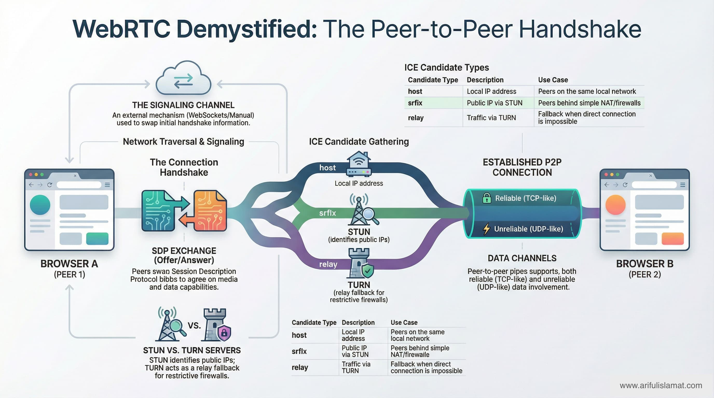

# WebRTC Learning Playground

A hands-on WebRTC experiment for developers who learn by building. This repository implements **peer-to-peer data channel communication** from scratch — no frameworks, no abstractions, just raw WebRTC APIs with clear annotations.

<p align="center">
  
</p>

---

## What's Inside

| File            | Purpose                                                                       |
| --------------- | ----------------------------------------------------------------------------- |
| `sender.html`   | **Manual mode** — creates an SDP offer, sends messages via data channel       |
| `receiver.html` | **Manual mode** — accepts the offer, creates an answer, receives messages     |
| `auto.html`     | **Auto mode** — WebSocket-based signaling, open in two tabs and it just works |
| `server.js`     | Minimal WebSocket signaling server + static file server                       |

---

## Quick Start

### Option 1: Manual Copy-Paste (no server needed)

Perfect for understanding the signaling flow — you **are** the signaling server.

```bash
# Just open both files directly in your browser
open sender.html    # or double-click
open receiver.html
```

Then follow the 3-step flow on each page:

1. **Sender** → Click "Create Offer" → Copy the offer JSON
2. **Receiver** → Paste the offer → Click "Set Offer" → Copy the answer JSON
3. **Sender** → Paste the answer → Connection established → Chat!

### Option 2: Auto-Signaling (with WebSocket server)

The signaling happens automatically via WebSocket — closer to how real apps work.

```bash
npm install     # install ws dependency (one time)
npm start       # start signaling server on port 8080
```

Then open **two tabs** to [http://localhost:8080](http://localhost:8080). The first tab becomes the sender, the second becomes the receiver. Once connected, all chat messages flow directly peer-to-peer.

---

## How WebRTC Works — A Developer's Guide

### The Core Problem

Two browsers want to talk directly. But they don't know each other's IP addresses, they're behind NATs/firewalls, and they need to agree on media/data formats. WebRTC solves all of this.

### The Connection Flow

```
┌──────────┐                                          ┌──────────┐
│  Sender  │                                          │ Receiver │
│ (Browser)│                                          │ (Browser)│
└────┬─────┘                                          └────┬─────┘
     │                                                     │
     │  1. Create RTCPeerConnection                        │
     │  2. Create Data Channel                             │
     │  3. Create Offer (SDP)                              │
     │  4. Set Local Description                           │
     │                                                     │
     │  ──────── Offer (via signaling) ──────────────►     │
     │                                                     │
     │                         5. Set Remote Description   │
     │                         6. Create Answer (SDP)      │
     │                         7. Set Local Description    │
     │                                                     │
     │  ◄──────── Answer (via signaling) ────────────      │
     │                                                     │
     │  8. Set Remote Description                          │
     │                                                     │
     │  ◄──────── ICE Candidates (both ways) ────────►     │
     │                                                     │
     │  ═══════ Direct P2P Connection Established ═══════  │
     │                                                     │
     │  ◄══════════ Data Channel Messages ════════════►    │
     │         (no server involved anymore!)               │
```

### Key Concepts

#### 1. SDP (Session Description Protocol)

SDP is a text format that describes a peer's capabilities: what codecs it supports, what media it wants to send/receive, network information, etc.

```
v=0
o=- 123456 2 IN IP4 127.0.0.1
s=-
t=0 0
a=group:BUNDLE 0
m=application 9 UDP/DTLS/SCTP webrtc-datachannel
a=ice-ufrag:abcd
a=ice-pwd:efghijklmnop
a=fingerprint:sha-256 AA:BB:CC:...
a=setup:actpass
a=sctp-port:5000
```

The **offer** says "here's what I can do." The **answer** says "here's what I'll do from your options."

#### 2. ICE (Interactive Connectivity Establishment)

ICE finds the best network path between peers. It gathers **candidates** — possible ways to reach the peer:

| Candidate Type               | What It Is                             | When It's Used                       |
| ---------------------------- | -------------------------------------- | ------------------------------------ |
| **host**                     | Local IP address (e.g., `192.168.1.5`) | Both peers on same local network     |
| **srflx** (Server Reflexive) | Public IP discovered via STUN          | Peers behind simple NAT              |
| **relay**                    | Traffic relayed via TURN server        | When direct connection is impossible |

ICE tries each candidate and picks the one with the lowest latency that actually works.

#### 3. STUN & TURN Servers

- **STUN** (Session Traversal Utilities for NAT): A lightweight server that tells you your public IP. Like asking "what's my address?" to someone outside your house. Free STUN servers exist (e.g., Google's `stun:stun.l.google.com:19302`).

- **TURN** (Traversal Using Relays around NAT): A relay server that forwards traffic when direct connection fails (~10-15% of cases). Costs bandwidth because all data flows through the server.

```
Direct (preferred):     Peer A ←──────────────→ Peer B
Via TURN (fallback):    Peer A ←───→ TURN ←───→ Peer B
```

#### 4. Signaling

WebRTC does NOT define how peers exchange offers/answers. That's "signaling" and it's your responsibility. Common approaches:

| Method            | Complexity | Use Case                              |
| ----------------- | ---------- | ------------------------------------- |
| Copy-paste        | None       | Learning / debugging                  |
| WebSocket         | Low        | Small apps, demos                     |
| HTTP polling      | Low        | Serverless-friendly                   |
| Firebase/Supabase | Medium     | Production apps without custom server |
| Custom server     | High       | Full control, scalability             |

This repo demonstrates **copy-paste** (manual mode) and **WebSocket** (auto mode).

#### 5. Data Channels

Data channels are like WebSockets, but peer-to-peer. They support:

- **Reliable** (TCP-like): Guaranteed delivery, ordered. Good for chat, file transfer.
- **Unreliable** (UDP-like): Fast, no guarantees. Good for gaming, live telemetry.

```javascript
// Sender creates the channel
const channel = pc.createDataChannel("chat", {
  ordered: true, // guaranteed order (default)
  // maxRetransmits: 3, // or set for partial reliability
});

// Receiver gets it via event
pc.ondatachannel = (event) => {
  const channel = event.channel;
  channel.onmessage = (e) => console.log(e.data);
};
```

### The Two Modes in This Repo

#### Manual Mode (`sender.html` + `receiver.html`)

Uses **vanilla ICE** (all candidates are gathered first, then embedded in the SDP). The full SDP with candidates is copied as one blob. Simpler to understand, slightly slower.

```
Sender                You (clipboard)           Receiver
  │                        │                       │
  │── create offer ───►    │                       │
  │   (wait for ICE)       │                       │
  │── copy full SDP ──►    │── paste ────────────► │
  │                        │                       │── create answer
  │                        │                       │   (wait for ICE)
  │    ◄── paste ─────     │  ◄── copy full SDP ── │
  │── set answer           │                       │
  │══════════════ Connected (P2P) ════════════════ │
```

#### Auto Mode (`auto.html` + `server.js`)

Uses **trickle ICE** (candidates are sent as they're discovered). Faster connection establishment.

```
Sender              Signaling Server           Receiver
  │                      │                        │
  │── offer ────────►    │── forward ────────►    │
  │                      │                        │── answer
  │    ◄── forward ──    │    ◄── answer ─────    │
  │── ICE candidate ►    │── forward ────────►    │
  │    ◄── forward ──    │   ◄── ICE candidate ── │
  │═══════════════ Connected (P2P) ═══════════════│
  │           (server no longer needed)           │
```

---

## Project Structure

```
webrtc/
├── sender.html       # Manual mode: creates offer, sends data
├── receiver.html     # Manual mode: answers offer, receives data
├── auto.html         # Auto mode: WebSocket signaling, open in 2 tabs
├── server.js         # Signaling server (WebSocket + HTTP)
├── package.json      # Dependencies (ws)
├── .gitignore
└── README.md         # You are here
```

---

## Learning Resources

### Official Documentation

- [WebRTC API — MDN](https://developer.mozilla.org/en-US/docs/Web/API/WebRTC_API) — The definitive API reference
- [WebRTC.org](https://webrtc.org/) — Official project site with samples
- [RTCPeerConnection — MDN](https://developer.mozilla.org/en-US/docs/Web/API/RTCPeerConnection) — Core API docs
- [RTCDataChannel — MDN](https://developer.mozilla.org/en-US/docs/Web/API/RTCDataChannel) — Data channel API

### Interactive Learning

- [WebRTC for the Curious](https://webrtcforthecurious.com/) — Free online book, explains protocols deeply
- [WebRTC Samples](https://webrtc.github.io/samples/) — Official code samples for every feature
- [WebRTC Internals](chrome://webrtc-internals/) — Chrome's built-in debugging tool (paste in Chrome address bar)

### Video Tutorials

- [WebRTC Crash Course — Traversy Media](https://www.youtube.com/watch?v=WmR9IMUD_CY)
- [WebRTC Full Course — freeCodeCamp](https://www.youtube.com/watch?v=QsH8FL0952k)
- [Peerjs, WebRTC — Fireship](https://www.youtube.com/watch?v=WmR9IMUD_CY)

### Deep Dives

- [High Performance Browser Networking — Ch.18 WebRTC](https://hpbn.co/webrtc/) — Ilya Grigorik's deep dive
- [RFC 8825 — WebRTC Overview](https://datatracker.ietf.org/doc/html/rfc8825) — The actual protocol spec
- [ICE RFC 8445](https://datatracker.ietf.org/doc/html/rfc8445) — How ICE works under the hood
- [SDP Anatomy — webrtchacks](https://webrtchacks.com/sdp-anatomy/) — Understand every line of an SDP

### Tools & Debugging

- **Chrome:** `chrome://webrtc-internals/` — Real-time stats, ICE candidate graph, SDP viewer
- **Firefox:** `about:webrtc` — Similar debugging dashboard
- [Trickle ICE](https://webrtc.github.io/samples/src/content/peerconnection/trickle-ice/) — Test your STUN/TURN configuration

### Libraries for Production

| Library                                              | Use Case                               |
| ---------------------------------------------------- | -------------------------------------- |
| [PeerJS](https://peerjs.com/)                        | Simple P2P with managed signaling      |
| [simple-peer](https://github.com/feross/simple-peer) | Lightweight WebRTC wrapper             |
| [mediasoup](https://mediasoup.org/)                  | SFU for video conferencing             |
| [Livekit](https://livekit.io/)                       | Production-grade WebRTC infrastructure |
| [Socket.io](https://socket.io/)                      | Popular choice for signaling servers   |

---

## Cross-Device Testing

To test between two devices (e.g., laptop + phone on the same Wi-Fi):

1. Start the server — it will print your local network IP:
   ```bash
   npm start
   # Output:
   #   Local:    http://localhost:8080/
   #   Network:  http://192.168.1.42:8080/
   ```
2. Open the **Network URL** on both devices
3. First device becomes the sender, second becomes the receiver

> **Different networks?** The code includes a free TURN relay server ([Open Relay](https://www.metered.ca/tools/openrelay/)) as a fallback, so connections work even when direct P2P is blocked by NAT or firewalls.

| Scenario | STUN only | STUN + TURN (current setup) |
|---|---|---|
| Same device, two tabs | ✅ | ✅ |
| Same Wi-Fi, two devices | ✅ (usually) | ✅ |
| Different networks | ❌ | ✅ |
| Behind strict corporate firewall | ❌ | ✅ (TCP TURN) |

> **For production**, use a dedicated TURN service like [Metered](https://www.metered.ca/tools/openrelay/), [Twilio](https://www.twilio.com/docs/stun-turn), or [Cloudflare Calls](https://developers.cloudflare.com/calls/) instead of the free Open Relay.

---

## Common Pitfalls

| Pitfall                                            | Solution                                                                        |
| -------------------------------------------------- | ------------------------------------------------------------------------------- |
| Offer/answer copied before ICE gathering completes | Wait for `onicecandidate` to fire with `null` (vanilla ICE), or use trickle ICE |
| Data channel created after `createOffer()`         | Always create the data channel **before** calling `createOffer()`               |
| No STUN servers configured                         | Add at least one STUN server to `iceServers` config                             |
| Answer never sent back to sender                   | Both sides need `setLocalDescription` AND `setRemoteDescription`                |
| Works on localhost but not over network            | You likely need a **TURN** server for production                                |
| `ICE failed` error                                 | Firewall/NAT too restrictive — configure a TURN server                          |

---

## Brave Browser & WebRTC

> **TL;DR:** Manual copy-paste mode may fail in Brave. Use auto mode (`node server.js` → `localhost:8080`) instead, or disable mDNS anonymization.

Brave anonymizes local IP addresses by replacing them with `.local` mDNS hostnames (e.g., `944e5bd0-6704-48b8-9f13-2e5fd9f8a5ee.local` instead of `192.168.1.5`). This is a **privacy feature** to prevent WebRTC IP leaks.

**Why manual mode breaks:** In vanilla ICE, all ICE candidates are embedded in the SDP blob you copy-paste. When the other tab receives the SDP, it can't resolve the `.local` mDNS addresses — so ICE connectivity checks fail and the connection goes `checking` → `disconnected`.

**Why auto mode works:** In trickle ICE (auto mode via `server.js`), candidates are exchanged individually through the signaling server. The browser can resolve `.local` candidates in real-time over the local network, so the connection succeeds.

**Fixes for manual mode (pick one):**

1. **Use auto mode** — `node server.js` → open `http://localhost:8080` in two tabs
2. **Disable mDNS anonymization** — navigate to `brave://flags/#enable-webrtc-hide-local-ips-with-mdns` → set to **Disabled** → relaunch Brave
3. **Lower Brave Shields** — click the lion icon in the address bar → toggle Shields off for the page

> Safari exposes real local IPs by default, so manual mode works there without issue. Chrome behaves similarly to Brave if WebRTC IP handling is set to restrict in `chrome://flags`.

---

## Next Steps

Once you're comfortable with data channels, try extending this project:

- [ ] Add **video/audio** streaming with `getUserMedia()` and media tracks
- [ ] Implement a **file transfer** system over data channels
- [ ] Add **TURN server** support for production NAT traversal
- [ ] Build a **multi-peer** mesh network (connect 3+ peers)
- [ ] Replace WebSocket signaling with **Firebase Realtime Database**
- [ ] Deploy the signaling server and test across different networks

---

## License

MIT — Use this however you want. If it helped you learn, consider giving it a star.

Built with curiosity by [Ariful Islam](https://arifulislamat.com).
